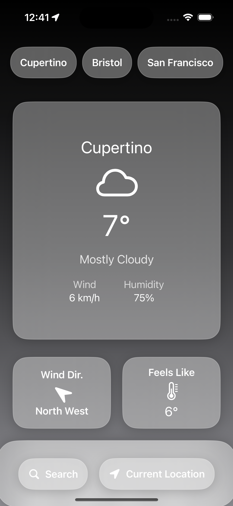
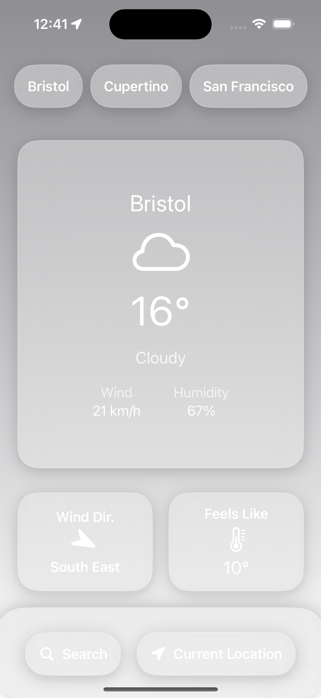
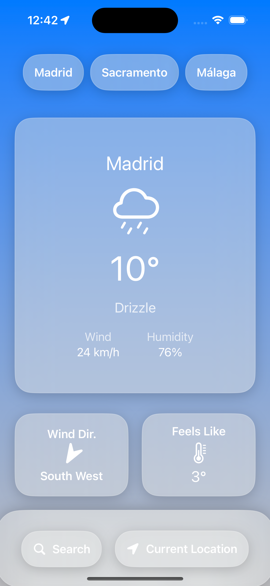

# Cumulus

A beautiful, modern iOS and MacOS weather app built with SwiftUI and WeatherKit. Cumulus provides accurate and hyperlocal forecasts, easy-to-read weather cards, and customizable widgets.

---

## Features

- **Current Weather**: Temperature, feels-like, precipitation, wind, visibility, UV index, and more.
- **Hourly & Daily Forecasts**: Quickly see what’s coming up for the rest of the day or the next week.
- **Weather Cards**: Each weather metric is presented in a mini card for quick glances.
- **Widgets**: Individual mini-card widgets (precipitation, feels-like, etc.) that can be placed on your iOS home screen.
- **SwiftUI**: A clean, modern UI with smooth animations.
- **WeatherKit Integration**: High-quality, real-time weather data from Apple’s WeatherKit.
- **Dark Mode Support**: Adapts beautifully to your device’s appearance settings.

---

## Screenshots

