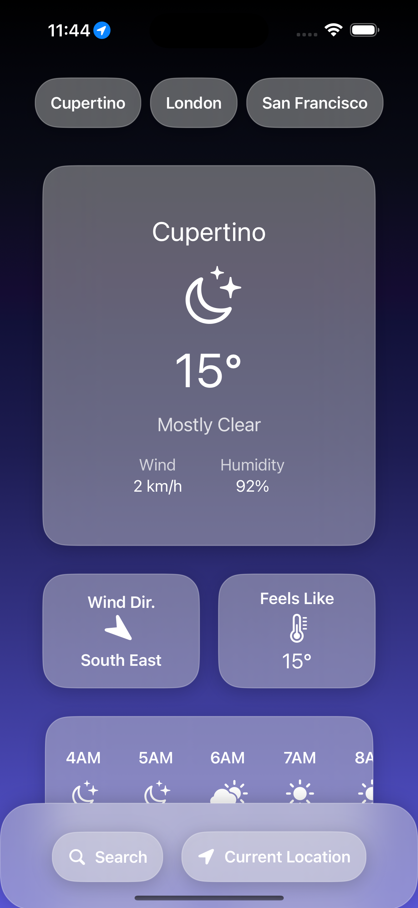
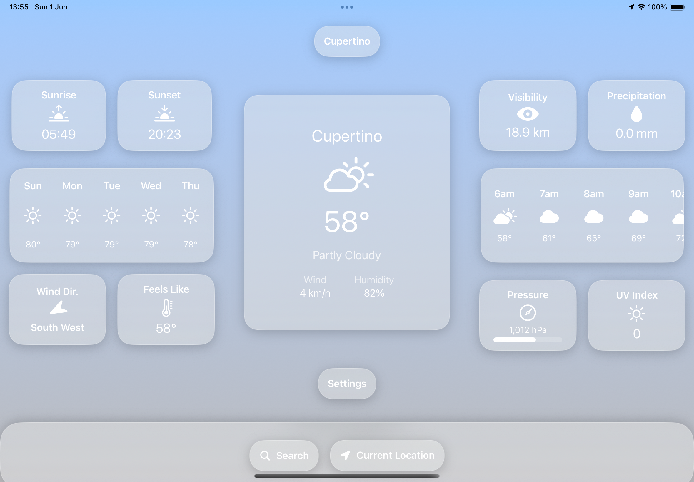

# Cumulus

  
    

  
   
  
  
  
  

A beautiful, modern iOS, macOS, and watchOS weather app built with SwiftUI and WeatherKit.  
Cumulus provides accurate and hyperlocal forecasts, easy-to-read weather cards, and customizable widgets.

## Features

- **Cross-Platform**: Native iOS, iPadOS, macOS and watchOS support
- **Current Weather**: Temperature, feels-like, precipitation, wind, visibility, UV index, and more
- **Hourly & Daily Forecasts**: Quickly see what's coming up for the rest of the day or the next week
- **Weather Cards**: Each weather metric is presented in a mini card for quick glances
- **Widgets**: SwiftUI + WidgetKit widgets for home screen personalization
- **Custom App Icons**: Easily switch icons using Apple's alternate icon system
- **Dark Mode Support**: Adapts to your system appearance
- **WeatherKit Integration**: Real-time weather data from Apple's WeatherKit
- **SwiftUI**: Clean, modern UI with smooth animations
- **Liquid Glass Design**: Modern translucent UI elements inspired by Apple's design language

## Screenshots

<table>
  <tr>
    <td align="center"></td>
    <td align="center"></td>
  </tr>
  <tr>
    <td align="center" colspan="2"><b>iPad & Mac OS Views</b></td>
  </tr>
  <tr>
    <td align="center"></td>
    <td align="center"></td>
  </tr>
</table>

## Development Status

### Version 3.0 Beta
Currently in development with the following enhancements:
- New dedicated watchOS app
- Completely refactored codebase prioritizing modularity and maintainability
- Integration with the stock iOS tab view
- Implementation of "liquid glass" design elements throughout the UI
- Performance improvements and optimizations

Beta is available as a `.ipa` file in the Beta directory or as an Xcode project you can build yourself.

## Custom Icons

  
  
  
  

Cumulus comes with multiple custom app icons. Additionally, you can create your own:

- Included in the `icon-templates` folder are Photoshop files with layers for:
  - Weather glyphs

## Built With

- `SwiftUI` - UI framework
- `WeatherKit` - Weather data provider
- `WidgetKit` - Home screen widgets
- `CoreLocation` - Location services

## License

© 2025 Josh Mansfield. All rights reserved.

